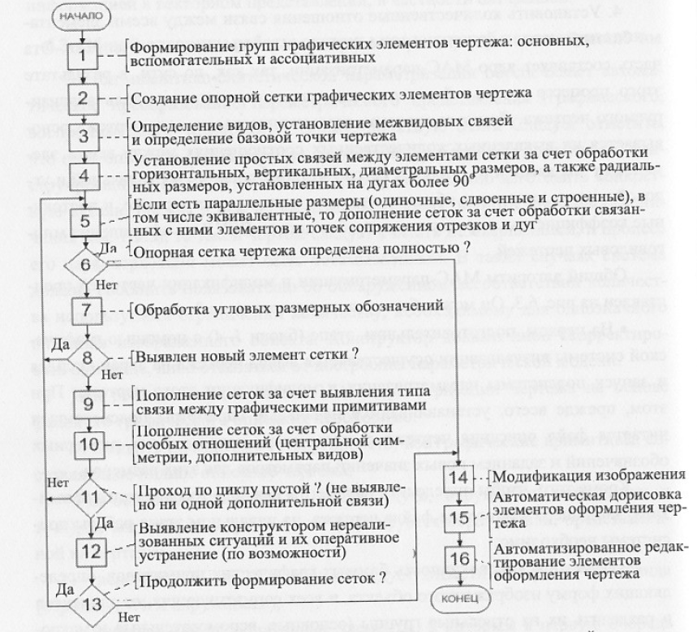

# Вопрос 27: Общий алгоритм работы системы последующей параметризации.

Метод аналитико-синтетической параметризации обеспечивает автоматическое преобразование параметрического представления в форму, понятную для ЭВМ.

Для решения общей задачи МАС-параметризации чертежа на основе файла его графического описания необходимо:
1. Выявить и разделить (отсортировать) все графические примитивы, составляющие полное описание чертежа:
- на основные или базовые (отрезки, дуги, окружности, полилинии и т.п.), из которых непосредственно формируется образ детали, представленной на чертеже;
- вспомогательные, к которым следует отнести оси различного вида (отрезки, дуги и окружности);
- макросы или ассоциативные элементы, к которым в первую очередь относятся образы размерных обозначений различного вида, определяющие параметры основных элементов, а также всевозможные технологические обозначения, сортируемые по типам, текстам примечаний, форматы с основными и дополнительными надписями.
2. Создать нерегулярную ортогональную опорную сетку чертежа.
3. Создать угловую сетку чертежа.
4. Установить количественные отношения связей между всеми элементами базовой сетки через размерные параметры, нанесенные на чертеже.

### Общий алгоритм МАС-параметризации и модификации чертежей.

