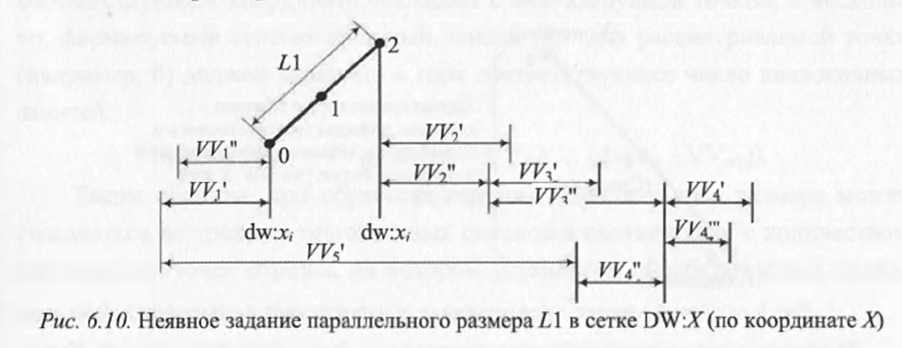
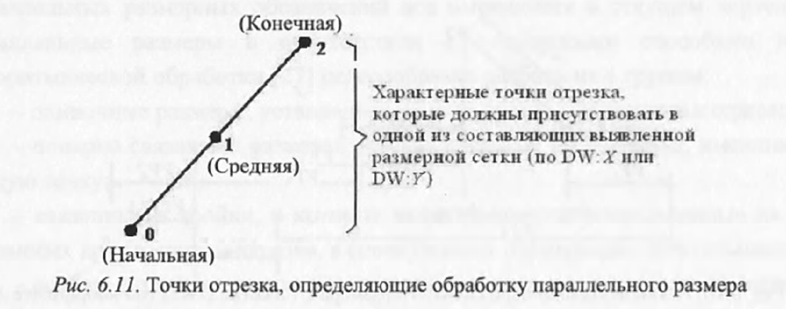
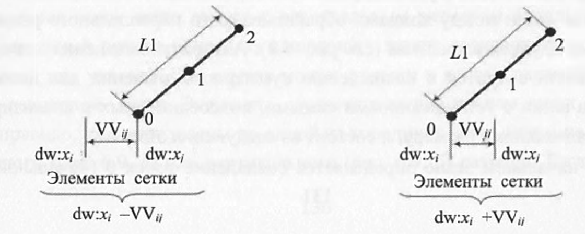
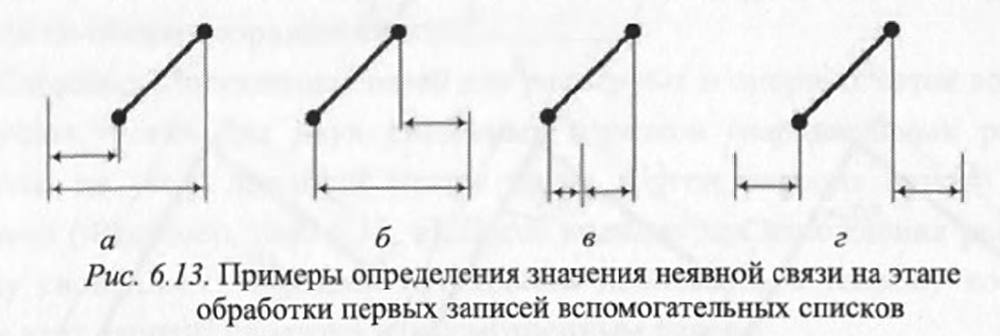

# Вопрос 33: Алгоритм выявления неявной связи на основе ранее определенных элементов базовой сетки при обработке отдельных параллельных размеров.

При обработке параллельного размера оба конца отрезка, на который поставлен этот размер, должны быть обязательно связаны с элементами выявленной размерной сетки (dw: x_i или dw:y_j), которые уже находятся в одном из двух подсписков элементов вспомогательной базовой опорной сетки (размерной сетки) DW:X или DW:Y параметрической модели. Иными словами, данные элементы размерной сетки должны присутствовать в списках уже установленных связей с другими элементами по этой составляющей. Тогда связь для отрезка по координате (X или Y) может быть определена через цепочки известных связей между элементами размерной сетки по этой координате (Рисунок 6.10).

Алгоритм выявления значения неявной связи сводится к нахождению суммарного значения для цепочки элементов сетки с установленными связями, подсоединенных к анализируемому параллельному размеру, и состоит из следующих этапов:
- На начальном этапе определяется совпадение точек 0 (начальной), 1 (средней для отрезка с осью симметрии или симметричного размерного обозначения) или 2 (конечной) отрезка, на который поставлен параллельный размер (Рисунок 6.11), с одним из первых двух элементов в списках размерной сетки по координате X или Y. Для выявления совпадения используются не исходные списки размерной сети, а их копии, чтобы при поиске условий совпадения не исказить исходное описание. Дублирующий список по координате X имеет вид:

В случае совпадения элементов по крайней мере для двых из трех точек отрезка, начинают формироваться вспомогательные списки (массивы) для соответствующего совпадающего элемента сетки в виде

где dw:x_i или dw:x_j - первый параметр этой записи, соответствующий свободному (не совпадающему) элементу записи из списка размерной сетки (dw:x_i dw:x_j VV_ij); запись -VV_ij (Рисунок 6.12 а) делается в том случает, если характерная точка привязки совпадает с элементом, который является вторым в выявленной записи списка размерной сетки (второй элемент записи в сетке совпадает с элементом базовой сетки рассматриваемой точки отрезка, на котором установлен параллельный размер); запись +VV_ij (Рисунок 6.12 б) создается в том случае, если запись в модели привязана к характерной точке отрезка своим первым элементом.

При этом из списка копии размерной модели для ускорения дальнейшего поиска исключают те записи, для которых выявлено совпадение элементов.

Если в размерной модели имеется не одна запись, элемент которой по соответствующей координате совпадает с анализируемой точкой, а несколько, формируемый вспомогательный список Sp для рассматриваемой точки (например 0) должен включать в себя соответствующее число аналогичных записей:

- На втором этапе определяется значение неявной связи при обработке вспомогательных списков с записями, которые непосредственно связаны с характерными точка отрезка. Для этого выявляется совпадение первых параметров в записи одного списка с записью другого списка и вычитание значения VV_ij, соответствующего точке с большим номером Sp_i, из меньшего, например

Если совпадение установлено, считается, что параметр связи VV_s между элементами базовой сети определен, и размерная сетка пополняется по этой координате (Рисунок 6.13 а б в). Иначе (Рисунок 6.13 г) переходят к третьему этапу.

- На третьем этапе в циклах по всем записям вспомогательных второго и третьего списков осуществляется поиск совпадения первых значений каждой записи с одним из первых двух элементов в записях копии списка размерной сетки так, как это делалось на первом этапе. В случае выявления совпадения корректируется соответствующая запись вспомогательного списка - меняется первый элемент записи на свободный (не совпадающий) элемент записи модели, а новое значение VV_s определяется алгебраической суммой элемента в записи вспомогательного списка и в записи размерной сетки в соответствии с формулой (6.10). Далее происходит возврат ко второму этапу. Подобные переходы со 2 на 3 этап и обратно осуществляются до тех пор, пока не будет выявлено значение неявной связи или не будет полностью вычищено дублирующий список размерной сетки. В последнем случае считается, что неявная связь не определена и данных параллельный размер необходимо перенести в конец списка необработанных размеров, временно отложив его обработку. Пополнение размерной сетки продолжается за счет обработки других размерных обозначений. 

> Страницы 131-134
