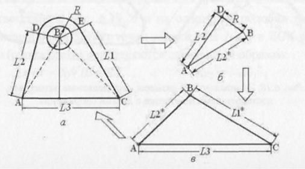
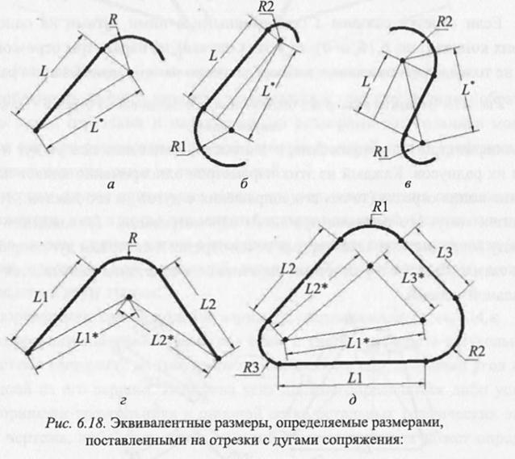
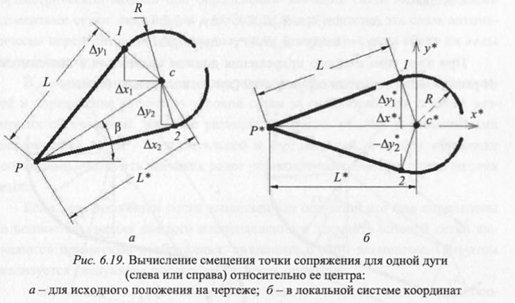
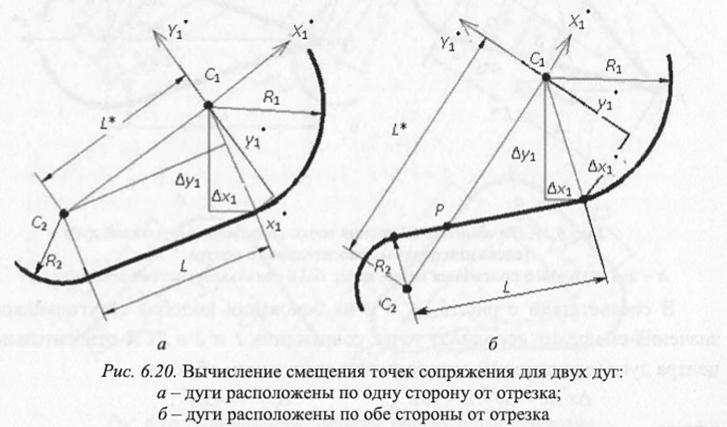

# Вопрос 38. Алгоритм обработки параллельного размера, поставленного на отрезок с дугами сопряжения на его двух концах. При этом обе дуги расположены по одну сторону линии, совпадающей с отрезком.

### Обработка параллельных размеров, установленных на отрезки

Обработка вертикальных и горизонтальных размеров для формирования размерной сетки чертежа и установления связей между соответствующими элементами базовой сетки по координатам X и Y осуществляется на первом этапе общего алгоритма МАС-параметризации (см. [билет 27](27.md)) и не представляет сложности из-за простоты и очевидности данного процесса. Поскольку такие размерные обозначения непосредственно (явно) связаны с соответствующими элементами базовой сетки чертежа, нет смысла останавливаться на этом процессе более подробно.

Более интересен дальнейший процесс формирования размерной сетки, который связан с обработкой линейных параллельных (наклонных) и угловых размерных обозначений. Для решения задачи обработки параллельных размерных обозначений все имеющиеся в текущем чертеже параллельные размеры в соответствии с возможными способами их алгоритмической обработки целесообразно разбить на 4 группы:
 * одиночные размеры, устанавливаемые на отдельные наклонные отрезки;
 * попарно связанные размеры, устанавливаемые на 2 отрезка, имеющих общую точку;
 * связанные в тройки, в которые входят размеры, установленные на 3 связанных друг с другом отрезка, в совокупности образующие треугольники;
 * особые случаи, куда следует отнести размеры, поставленные на отрезки, на конце (концах) которых находятся одна или две дуги сопряжения.

### Размеры, поставленные на отрезки с дугами сопряжения

Если отрезки связаны с сопряженными с ними дугами на одном или обоих концах (рис. 6.16, а-д), то в этих случаях на параметры отрезков влияют не только установленные непосредственно на них параллельные размеры, но и параметры дуг сопряжения, в частности, положение центра дуг и значения их радиусов. Каждый из этих параметров одновременно влияет на положение конца отрезка (точки его сопряжения с дугой) и его наклон. Это приводит к тому, что решение проблемы параметризации (нахождение связей между координатами характерных точек отрезка и центрами дуг сопряжения) для таких объектов в различных вариантах их сочетания оказывается нетривиальной задачей.

Чтобы разрешить эту сложную ситуацию, для пополнения размерной сетки предлагается на время заменить пару, состоящую из связанных параллельного и радиального размеров, одним параллельным размером (рис. 6.17, a-в). Этот размер (L2 \*), порожденный парой связанных размеров (L2, R), может быть назван эквивалентным или фиктивным параллельным размером. Такие эквивалентные размеры являются как бы порождением исходной пары и должны определяться значениями радиусов дуг сопряжения и связаных с ними параллельных исходных размеров ( L2\* = $$ \sqrt{L^2 +R^2} $$). Введение таких размеров позволяет разделить задачу автоматического нахождения параетрических связей характерных точек подобных фигур на 2 этапа.

На первом этапе должна решаться задача определения связей координат центра дуги (дуг) с элементами сетки, для которых связи уже установлены. Эта задача решается аналогично рассмотренным ранее вариантам при анализе обычных параллельных размеров, которые установлены на отрезки (см. билеты 34-36)

На втором этапе устанавливается связь между координатами центра дуги и точкой сопряжения соответствующей дуги и отрезка на основании значения радиуса дуги и значений исходного и эквивалентного параллельных размеров. На первый взгляд процесс нахождения координат точек сопряжения и, главное, установление их связей с другими элементами сетки (включение в размерную ммодель параметризации) достаточно сложен (рис. 6.18, а-д)). Однако его можно существенно упростить, если предварительно решать эту проблему с использованием локальной системы координат, начало которой совпадает с центром дуги сопряжения, а ось X (или Y) совпадает с отрезком, на котором устанавливается эквивалентный размер. Иными словами, ось должна проходить через центр дуги и свободный конец отрезка сопряжения при наличии одной дуги (рис. 6.19) либо через центры дуг сопряжения, если дуги находятся на обоих концах (рис. 6.20).

В соответствии с рис. 6.19, б и на основании подобия треугольников значения смещения координат точек сопряжения 1 и 2 в ЛСК относительно центра дуги (окружности) определяются следующим образом:

$$  \Delta x^{*}/R = \Delta y_1^{*}/L = R/L^{*};  \Delta y_2^{*} = -\Delta y_1^{*};  $$

откуда

$$  \Delta x^{*} = R^2/L^{*}; \Delta y_1^{*} = L R/L^{*};  \Delta y_2^{*} = -L R/L^{*}  $$

В этом случае смещение координат точек сопряжения 1 и 2 относитель­но центра в исходном состоянии (рис. 6.19, а) определяется с использованием матрицы поворота на угол против часовой стрелки:

$$
\begin{bmatrix}
   \Delta x^{*} & \Delta y_1^{*} \\
   \Delta x^{*} & \Delta y_2^{*}
\end{bmatrix}
\begin{bmatrix}
   cos \beta & sin \beta \\
   -sin \beta & cos \beta
\end{bmatrix}
$$

В результате перемножения матриц получаем смещение координат то­чек касания (левой 1 и правой 2) относительно центра дуги (окружности) по координате X и Y в исходном положении (рис. 6.19, а):

$$  \Delta x_1 = \Delta x^{*} cos \beta - \Delta y_1^{*} sin \beta;   \Delta y_1 = \Delta x^{*} sin \beta + \Delta y_1^{*} cos \beta;  $$
$$  \Delta x_2 = \Delta x^{*} cos \beta - \Delta y_2^{*} sin \beta;   \Delta y_2 = \Delta x^{*} sin \beta + \Delta y_2^{*} cos \beta;  $$

Нахождение смещения координат точек сопряжения отрезка с двумя ду­гами, расположенными по одну сторону от отрезка (рис. 6.20 , а), относитель­но координат центра соответствующей дуги (окружности) также не пред­ставляет никакой сложности, так как

$$ \Delta x_1 / abs(R_1 - R_2) = \Delta y_1 / L = R_1 / L^{*} $$

Отсюда:

$$ \Delta x_1 = abs(R_1 - R_2) R_1 / L^{*};   \Delta y_1 = R_1 L / L^{*}; $$
$$ \Delta x_2 = abs(R_1 - R_2) R_2 / L^{*};   \Delta y_2 = R_2 L / L^{*}; $$

При этом знак каждого приращения должен выявляться в зависимости от расположения центров окружностей (дуг) относительно отрезка.

