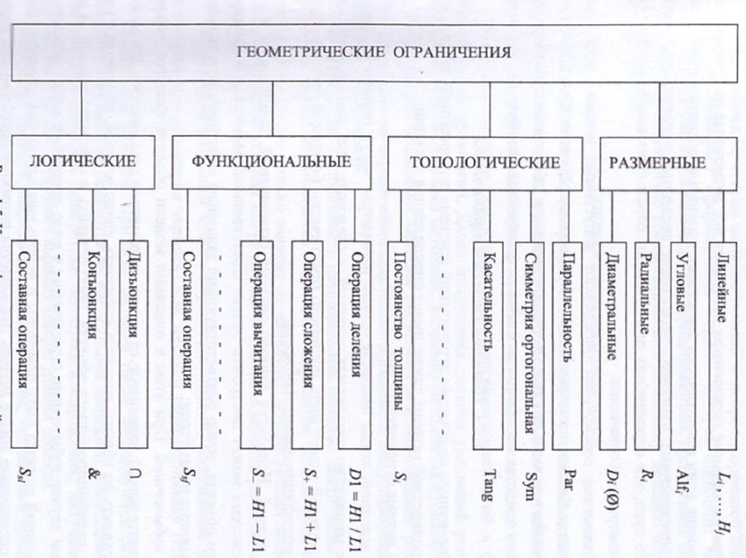

Ограничением (constraint) называется любое условие построения модели, связывающее положение или форму отдельного примитива относительно других. Совокупность примитивов объекта и ограничений, представленных в той или иной форме, полностью определяет параметрическую модель объекта. Поэтому учет всех ограничений является важной составляющей формирования параметрических моделей. Ограничения могут иметь различное происхождение и функциональное назначение.
Различают следующие виды ограничений (см.рисунок):
- размерные;
- топологические;
- функциональные (алгебраические);
- логические.
- 

Размерные ограничения объединяют совокупность размеров (параметров), численные значения которых задают положение базовых точек примитивов графического объекта относительно выбранной системы координат или ранее определенных примитивов этого объекта. Это могут быть любые виды и типы размерных обозначений, используемые при оформлении эскизов и чертежей - линейные, радиальные, диаметральные и угловые.Топологические ограничения определяют условия взаимосвязи графических примитивов и тем самым наряду с другими типами ограничений влияют на форму объекта. К типовым топологическим ограничениям относят условия
совпадения точек у разных примитивов, условия касания примитивов, их параллельность расположения, перпендикулярность, соосность, симметрию (ортогональную и центральную). К такому виду ограничений относят принадлежность примитивов определенному виду, эквивалентность (равнозначность) размеров отрезков, радиусов дуг и окружностей, постоянство толщины детали и др. При этом следует иметь в виду, что вводимые топологические ограниечния уменьшают количество размерных ограничений, необходимых при созании параметрических описаний моделей конструкторских объектов.

Функциональные ограничения включают все возможные выражения, определяющие одни семантически зависимые параметры объекта через другие, ранее определенные, например, через ранее введенные размерные обозначения. По сути, эти ограничения представляют собой функционально задаваемые размерные обозначения. Логические ограничения определяют допустимые условия отношений между отдельными геометрическими параметрами объектов. Они служат для того, чтобы при модификации форма получаемого объекта не принимала абсурдного представления с точки зрения ее физической реализации.
***
### Полнота системы ограничений
Совокупное количество ограничений (система ограничений), применяемое к конкретной модели, также имеет определенное значение.
Система ограничений может быть: 
- неполной, когда неопределенные параметры могут принимать бесконечное множество конкретных значений, а следовательно, при модификации таких моделей может быть построено практически бесконечное число вариантов модифицированного объекта;
- полной. Используя данную систему ограничений, заложенную в модель,
система может построить только единственный вариант модифицированного объекта, точно соответствующий заданным конструктором значениям задающих параметров;
- избыточной. При этом в описании модели объекта имеются лишние (дополнительные), зависимые от других параметров ограничения. Их можно либо удалить из общего списка и построить единственный (конкретный) вариант модифицированного объекта, либо оставить в описании модели. В последнем случае избыточные ограничения в виде дополнительных размерных обозначений должны быть помечены и использоваться не как управляющие, а как справочные, иначе модель оказывается неработоспособной как неправильно сформированная. В подобных случаях система не сможет осуществить модификацию объекта и вывод соответствующего изображения. Однако значения справочных размеров при модификации изображения могут противоречить управляющим и вводить в заблуждение конструктора, если не применять соответствующие средства автоматической коррекции их значений при преобразовании.

Таким образом, только наличие полной и непротиворечивой системы ограничений позволяет сформировать модель, которая обеспечит четкую связь и строгое расположение всех модифицированных примитивов объекта в пространстве, однозначно соответствующих исходному заданию параметровэтой модели.
